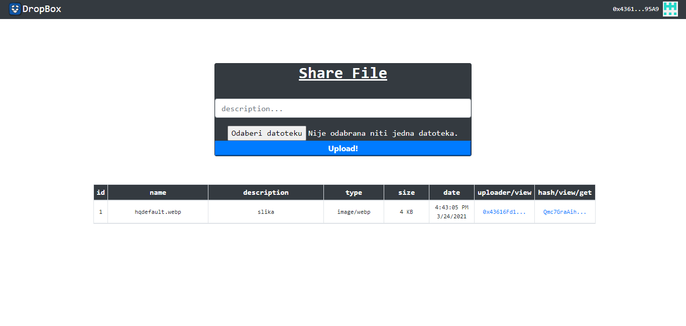

# Ethereum-Dropbox
<div style="float: right">


</div>

Dropbox clone based on Ethereum smart contracts.

<p float="left">

</p>

## Requirements
- MetaMask
- Web3.js
- Ganache

## Built with
- ReactJS
- Solidity


## Commands

- compiling

```
truffle compile
```

- deploying smart contract to blockchain

```
truffle migrate
```

- console

```
truffle console
```

- DStorage is the name of the smart contract that is created in migrations folder. We retrive deployed copy of smart contract and assign it to the variable dstorage

```
dstorage = await DStorage.deployed()
```

- We can access smart contract properties

```
dstorage.address
```

- deploying new copy to the blockchain (if we added some new code)

```
truffle migrate --reset

```
